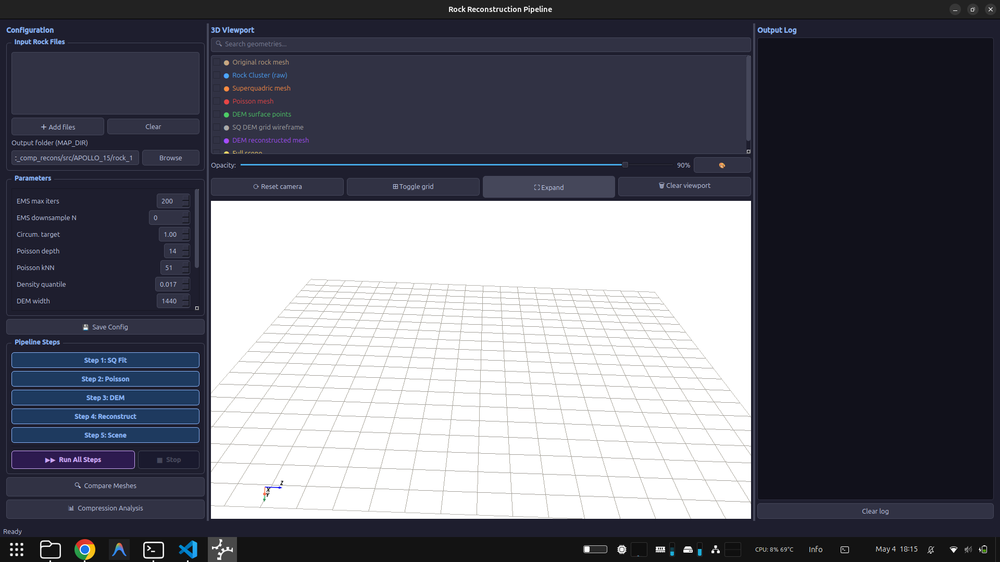

# pc_comp_recons

**Point Cloud Compression & Scene Reconstruction Pipeline**

A modular Python pipeline that takes a raw photogrammetry point cloud, isolates individual rock clusters, fits compact superquadric + DEM representations, and reconstructs the full scene — enabling significant storage compression while preserving geometric fidelity.

---

## Overview

```
Raw Point Cloud (.ply)
        │
        ▼
 Step 0 — RANSAC ground removal + DBSCAN clustering
        │  → Cluster_N.ply, ground_plane.ply/txt
        ▼
 Step 1 — EMS Superquadric fitting per cluster
        │  → sq_fit_Cluster_N.txt
        ▼
 Step 2 — Poisson surface reconstruction (reference meshes)
        │  → poisson_Cluster_N.ply
        ▼
 Step 3 — DEM generation (spherical elevation map)
        │  → dem_Cluster_N.npy, mask_Cluster_N.npy
        ▼
 Step 4 — DEM-based mesh reconstruction
        │  → dem_recon_Cluster_N.ply
        ▼
 Step 5 — Full scene assembly + comparison + analysis
           → scene_reconstruction.ply, analysis.txt
```

---

## Repository Structure

```
pc_comp_recons/
├── src/
│   ├── config.py               # ★ Central config — change only this file
│   ├── gui.py                  # PyQt5 graphical interface (recommended entry point)
│   ├── ems_core.py             # EMS superquadric fitting core
│   ├── utils.py                # Shared utilities
│   ├── Step_0_cluster_rocks.py
│   ├── Step_1_sq_ems_fit.py
│   ├── Step_2_poisson_recons.py
│   ├── Step_3_dem_generation.py
│   ├── Step_4_reconstruction.py
│   └── Step_5_scene_comparison.py
├── tools/
│   ├── run_experiments.py      # Batch run over Apollo dataset
│   ├── run_sim_experiments.py  # Batch run over sim rocks
│   ├── generate_comparison_images.py
│   ├── generate_comparison_video.py
│   └── sq_pipeline_video.py
└── io_op/
    ├── IROS_DATASET/           # Apollo moon rock inputs
    ├── Apollo_Rock/            # Experiment results & images
    └── sim_experiment_images/  # Simulated rock results
```

> **Note:** `.ply` files in `io_op/` are managed via [Git LFS](https://git-lfs.github.com/) due to their large size.

---

## Dependencies

- Python ≥ 3.10
- [Open3D](http://www.open3d.org/) — point cloud I/O, RANSAC, DBSCAN, Poisson reconstruction, visualisation
- NumPy
- SciPy
- PyQt5 + pyvista + pyvistaqt — GUI only

Install with:
```bash
pip install open3d numpy scipy PyQt5 pyvista pyvistaqt
```

---

## Using the GUI (Recommended)

The GUI provides a full graphical interface to run the pipeline, inspect intermediate results in 3D, and analyse compression — no command-line required after launch.

### Launch

```bash
cd pc_comp_recons
python src/gui.py
```



The window is split into three panels: **Configuration** (left), **3D Viewport** (centre), **Output Log** (right).

### Step-by-step workflow

**1. Add input rock files**

Click **＋ Add files** in the *Input Rock Files* group and select your rock mesh or point cloud files (`.ply`, `.obj`, `.stl`). Each file becomes one cluster (`Cluster_1.ply`, `Cluster_2.ply`, …) staged into the output folder automatically when you run Step 1.

> If you are starting from a raw scene that needs ground removal and clustering, run `Step_0_cluster_rocks.py` from the command line first, then point the GUI at the resulting folder.

**2. Set the output folder**

Click **Browse** next to *Output folder (MAP_DIR)* and select (or create) the directory where all pipeline files will be saved. This sets `MAP_FOLDER` in `config.py`.

**3. Tune parameters (optional)**

Adjust the spinboxes in the *Parameters* panel to change EMS fitting iterations, DEM resolution, Poisson depth, etc. Click **💾 Save Config** to write changes to `config.py` before running any step.

**4. Run the pipeline**

- Click **▶▶ Run All Steps** to execute Steps 1–5 sequentially. The 3D viewport updates after each step so you can watch the representation build up.
- Or click individual step buttons (**Step 1: SQ Fit**, **Step 2: Poisson**, …) to run one step at a time.
- Click **■ Stop** to abort a run-all sequence at any time.

**5. Inspect results in the 3D viewport**

The geometry checklist in the viewport panel lists all available pipeline outputs. Check any combination to overlay them:

| Geometry | Produced by |
|---|---|
| Rock Cluster (raw) | Step 1 (input staged) |
| Superquadric mesh | Step 1 |
| Poisson mesh | Step 2 |
| DEM surface points | Step 3 |
| DEM reconstructed mesh | Step 4 |
| Full scene | Step 5 |

Use **Opacity** slider and **🎨** colour picker to customise the display. **⛶ Expand** collapses the side panels for a full-screen 3D view.

**6. Compare meshes**

Click **🔍 Compare Meshes** to open the comparison dialog. Select a source (reference) and target (reconstructed) mesh, then click **⚡ Run Comparison** to compute:
- Bidirectional mean, median, 95th-percentile, and Hausdorff distances
- RMSE
- Normal angle deviation (mean, median, 95th-percentile)
- Error distribution histograms

Click **🌈 Show distance heatmap** or **🟡 Show normal angle heatmap** to visualise the per-point error directly in the 3D viewport (blue = low error, red = high error).

**7. Analyse compression**

Click **📊 Compression Analysis** to open a table showing, per cluster:
- Poisson `.ply` file size (uncompressed reference)
- SQ `.txt` + DEM `.npy` + mask `.npy` sizes (compressed representation)
- Compression ratio (×)
- Overall totals and percentage size reduction

---

## Command-line Usage

Run each step from the **repository root**, in order:

```bash
cd pc_comp_recons

python src/Step_0_cluster_rocks.py    # Segment ground + cluster rocks
python src/Step_1_sq_ems_fit.py       # Fit superquadrics to each cluster
python src/Step_2_poisson_recons.py   # Poisson reference meshes
python src/Step_3_dem_generation.py   # Generate spherical DEMs
python src/Step_4_reconstruction.py   # Reconstruct meshes from DEMs
python src/Step_5_scene_comparison.py # Assemble scene + analyse compression
```

Set `PC_HEADLESS=1` to suppress all Open3D visualisation windows (useful for batch runs):

```bash
PC_HEADLESS=1 python src/Step_1_sq_ems_fit.py
```

All intermediate outputs are saved to the directory specified by `MAP_FOLDER` in `src/config.py`.

---

## Configuration

All parameters are centralised in `src/config.py`. **You only need to edit this one file** (or use the GUI) to switch maps or tune the pipeline.

| Parameter | Default | Description |
|---|---|---|
| `MAP_FOLDER` | `"Prior_Map"` | Output folder path (absolute or relative to `io_op/`) |
| `RANSAC_DIST_THRESH` | `0.05` | Ground plane inlier distance (m) |
| `DBSCAN_EPS` | `0.05` | DBSCAN neighbourhood radius (m) |
| `MIN_CLUSTER_RATIO` | `0.10` | Minimum cluster size relative to largest |
| `EMS_MAX_ITERS` | `200` | Superquadric fitting iterations |
| `EMS_CIRCUMSCRIBE` | `True` | Scale SQ outward so all cluster points lie inside |
| `POISSON_DEPTH` | `14` | Poisson reconstruction tree depth |
| `DEM_W / DEM_H` | `1440 / 720` | Spherical DEM resolution (longitude × latitude bins) |

---

## Pipeline Steps & Output Files

### Step 0 — Rock Clustering
- Removes the ground plane iteratively using **RANSAC**
- Clusters remaining points with **DBSCAN**

| Output file | Description |
|---|---|
| `Cluster_N.ply` | Segmented rock point cloud (one per rock) |
| `ground_plane.txt` | RANSAC plane equation `[a b c d]` |
| `ground_plane.ply` | Ground inlier point cloud |

### Step 1 — Superquadric Fitting
- Fits an **EMS (Expectation-Maximisation Superquadrics)** shape to each cluster
- Optionally circumscribes the SQ so all cluster points lie strictly inside the shape

| Output file | Description |
|---|---|
| `sq_fit_Cluster_N.txt` | Superquadric parameters: axes `[ax, ay, az]`, exponents `[e1, e2]`, center, rotation |

### Step 2 — Poisson Reconstruction
- Estimates normals and runs **Poisson surface reconstruction** on each cluster
- Produces high-quality reference meshes used for accuracy benchmarking and DEM raycasting

| Output file | Description |
|---|---|
| `poisson_Cluster_N.ply` | High-resolution Poisson surface mesh (reference, not transmitted) |

### Step 3 — DEM Generation
- Raycasts inward from the SQ surface to the Poisson mesh to measure per-cell depth
- Encodes the rock surface as a compact **spherical elevation map (DEM)**

| Output file | Description |
|---|---|
| `dem_Cluster_N.npy` | Spherical depth map (float32, shape `H × W`) |
| `mask_Cluster_N.npy` | Valid-cell binary mask (uint8, shape `H × W`) |
| `recon_pts_Cluster_N.ply` | DEM surface reconstructed as a point cloud (for inspection) |

### Step 4 — DEM-based Reconstruction
- Displaces SQ grid points by their DEM depth along the inward normal
- Runs Poisson on the resulting point cloud to produce the final compact mesh

| Output file | Description |
|---|---|
| `dem_recon_Cluster_N.ply` | Final reconstructed rock mesh (decoded from compressed representation) |

### Step 5 — Scene Assembly & Analysis
- Merges all `dem_recon_Cluster_N.ply` meshes with a ground plane mesh into a full scene
- Computes compression ratios and Hausdorff geometric accuracy per cluster

| Output file | Description |
|---|---|
| `scene_reconstruction.ply` | Complete reconstructed scene (ground + all rocks) |
| `analysis.txt` | Compression report + geometric accuracy (Hausdorff distances) |

---

## Compressed Representation

The pipeline's compression scheme replaces each large Poisson mesh with three small files:

```
sq_fit_Cluster_N.txt   ~500 B    Superquadric shape + pose (11 floats)
dem_Cluster_N.npy      variable  Spherical depth map (float32)
mask_Cluster_N.npy     variable  Valid-cell mask (uint8)
─────────────────────────────────────────────────────────
Total compressed                 << poisson_Cluster_N.ply
```

The **Compression Analysis** dialog (GUI) or `analysis.txt` (CLI) reports the achieved ratio for each cluster. Typical results on Apollo rock samples show 10–50× size reduction with sub-centimetre geometric accuracy.

To reconstruct the rock mesh from the compressed files, run Steps 1 and 4 only (no raw point cloud needed):

```bash
python src/Step_1_sq_ems_fit.py    # reads sq_fit_Cluster_N.txt
python src/Step_4_reconstruction.py # reads sq_fit + dem + mask → dem_recon_Cluster_N.ply
```

---

## Git LFS

Large `.ply` point cloud files are stored using [Git LFS](https://git-lfs.github.com/). After cloning, run:

```bash
git lfs pull
```

to fetch the actual file contents.
